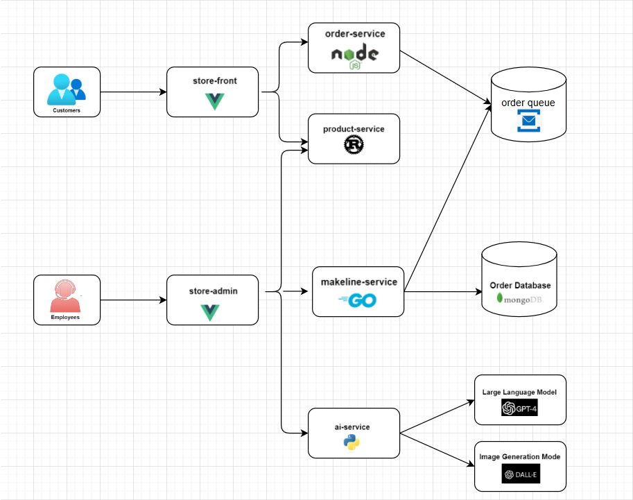

## **Project Requirements**  

Your submission must include the following:

### **1. GitHub Repository**
The GitHub repository must include:  
1. A `README.md` file containing:  
   - **Updated Application Architecture**:  
     - Draw the updated architecture diagram using `Draw.io` and include it in the README.  
     
   - **Application and Architecture Explanation**:  
     - Briefly explain the application functionality and how the architecture works.  
   - **Deployment Instructions**:  
     - Step-by-step instructions to deploy the application in a Kubernetes cluster.  

## Table of Microservice Repositories
A table listing each microservice repository and its GitHub link.
| Service              | Repository Link                                   |
|----------------------|---------------------------------------------------|
| Store-Front          | [Store-Front GitHub Link](https://github.com/Yue0218/store-front-Assignment2)          |
| Store-Admin          | [Store-Admin GitHub Link](https://github.com/Yue0218/store-admin-Assignment2)          |
| Order-Service        | [Order-Service GitHub Link](https://github.com/Yue0218/order-service-Assignment2)        |
| Product-Service      | [Product-Service GitHub Link](https://github.com/Yue0218/product-service-Assignment2)      |
| Makeline-Service     | [Makeline-Service GitHub Link](https://github.com/Yue0218/makeline-service-Assignment2)     |
| AI-Service           | [AI-Service GitHub Link](https://github.com/Yue0218/ai-service-Assignment2)           |
| MongoDB              | [MongoDB GitHub Link](https://github.com/docker-library/mongo)                     |
| Virtual-Customer     | [Virtual-Customer GitHub Link](https://github.com/Yue0218/virtual-customer-Assignment2)     |
| Virtual-Worker       | [Virtual-Worker GitHub Link](https://github.com/Yue0218/virtual-worker-Assignment2)       |
## Table of Docker Images
A table listing all Docker images you created, including their names and links to their Docker Hub repositories.
| Service             | Docker Image Link                                           |
|----------------------|------------------------------------------------------------|
| Store-Front          | [Store-Front Docker Hub Link](https://hub.docker.com/repository/docker/gaoyue218/store-front/tags)          |
| Store-Admin          | [Store-Admin Docker Hub Link](https://hub.docker.com/repository/docker/gaoyue218/store-admin/tags)          |
| Order-Service        | [Order-Service Docker Hub Link](https://hub.docker.com/repository/docker/gaoyue218/order-service/tags)        |
| Product-Service      | [Product-Service Docker Hub Link](https://hub.docker.com/repository/docker/gaoyue218/product-service/tags)      |
| Makeline-Service     | [Makeline-Service Docker Hub Link](https://hub.docker.com/repository/docker/gaoyue218/makeline-service/tags)     |
| AI-Service           | [AI-Service Docker Hub Link](https://hub.docker.com/repository/docker/gaoyue218/ai-service/tags)           |
| Virtual-Customer     | [Virtual-Customer Docker Hub Link](https://hub.docker.com/repository/docker/gaoyue218/virtual-customer/tags)     |
| Virtual-Worker       | [Virtual-Worker Docker Hub Link](https://hub.docker.com/repository/docker/gaoyue218/virtual-worker/tags)       |

    - **Any issues or limitations in the implementation (Optional)**

2. A **Deployment Files** subfolder:  
   - Include all Kubernetes deployment YAML files in a folder named `Deployment Files`.  
   - Ensure these files are clearly named (e.g., `store-front-deployment.yaml`, `order-service-deployment.yaml`).   

### **2. Demo Video**  
Record a **5-minute max demo video** showcasing the following:  
- The application in action after deployment to AKS cluster.  
- AI-generated product descriptions and images.  
- Integration with the managed order queue service.  

**Upload the video to YouTube** and include a link to the video in your `README.md` file under a "Demo Video" section.  

---

## **Resources**  
- **Algonquin Pet Store Repository:** [GitHub Link](https://github.com/ramymohamed10/algonquin-pet-store-on-steroids)  
---
